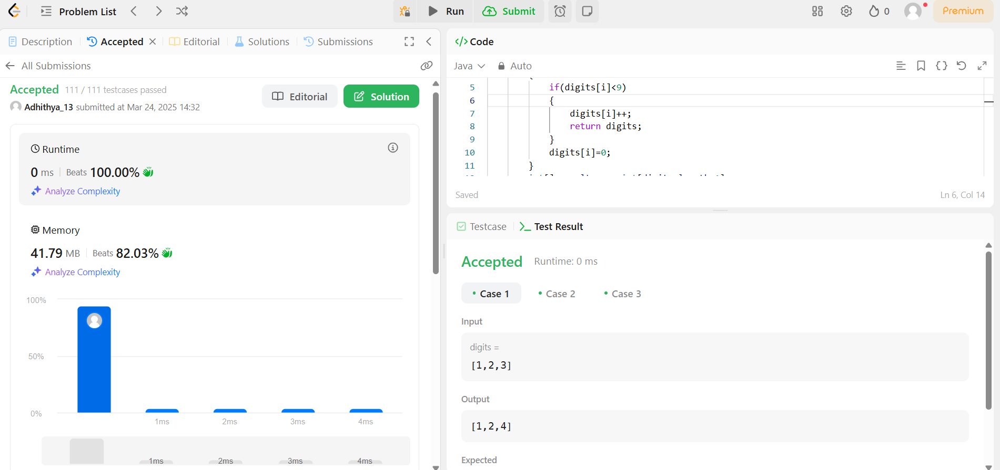

# LEETCODE
You are given a large integer represented as an integer array digits, where each digits[i] is the ith digit of the integer. The digits are ordered from most significant to least significant in left-to-right order. The large integer does not contain any leading 0's.

Increment the large integer by one and return the resulting array of digits.

 

Example 1:

Input: digits = [1,2,3]
Output: [1,2,4]
Explanation: The array represents the integer 123.
Incrementing by one gives 123 + 1 = 124.
Thus, the result should be [1,2,4].
Example 2:

Input: digits = [4,3,2,1]
Output: [4,3,2,2]
Explanation: The array represents the integer 4321.
Incrementing by one gives 4321 + 1 = 4322.
Thus, the result should be [4,3,2,2].
Example 3:

Input: digits = [9]
Output: [1,0]
Explanation: The array represents the integer 9.
Incrementing by one gives 9 + 1 = 10.
Thus, the result should be [1,0].
 

Constraints:

1 <= digits.length <= 100
0 <= digits[i] <= 9
digits does not contain any leading 0's.


ANSWER:
```java

import java.util.Arrays;

class Solution {
    public int[] plusOne(int[] digits) {
        for (int i = digits.length - 1; i >= 0; i--) {
            if (digits[i] < 9) {
                digits[i]++;
                return digits;
            }
            digits[i] = 0;
        }
        int[] result = new int[digits.length + 1];
        result[0] = 1;
        return result;
    }
}

public class Main_212222240002{
    public static void main(String[] args) {
        Solution solution = new Solution();
        
        // Test cases
        int[][] testCases = {
            {1, 2, 3},  
            {9, 9, 9},  
            {0},        
            {4, 5, 9}   
        };

        for (int[] testCase : testCases) {
            System.out.println("Input: " + Arrays.toString(testCase));
            int[] result = solution.plusOne(testCase);
            System.out.println("Output: " + Arrays.toString(result));
            System.out.println();
        }
    }
}
```


